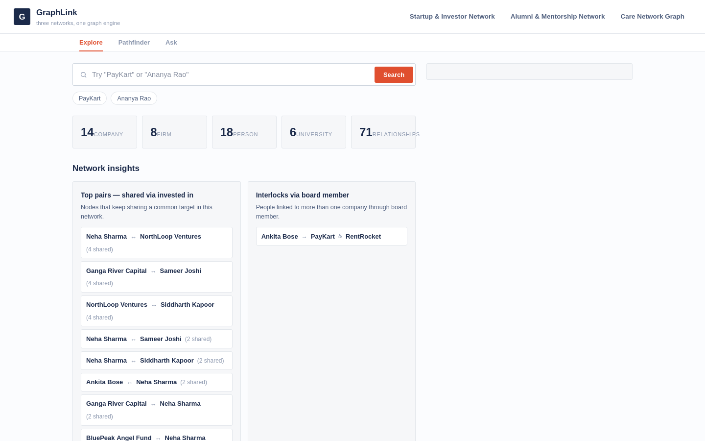
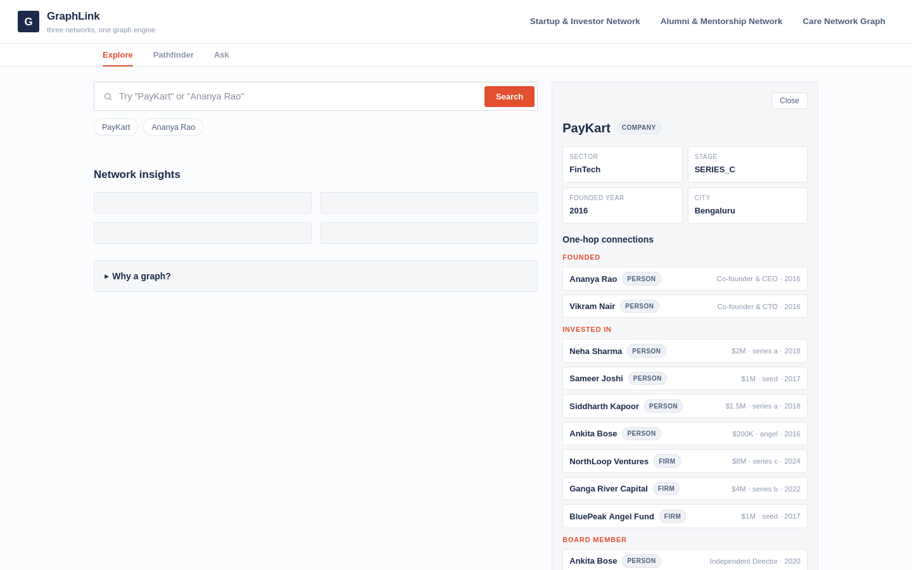
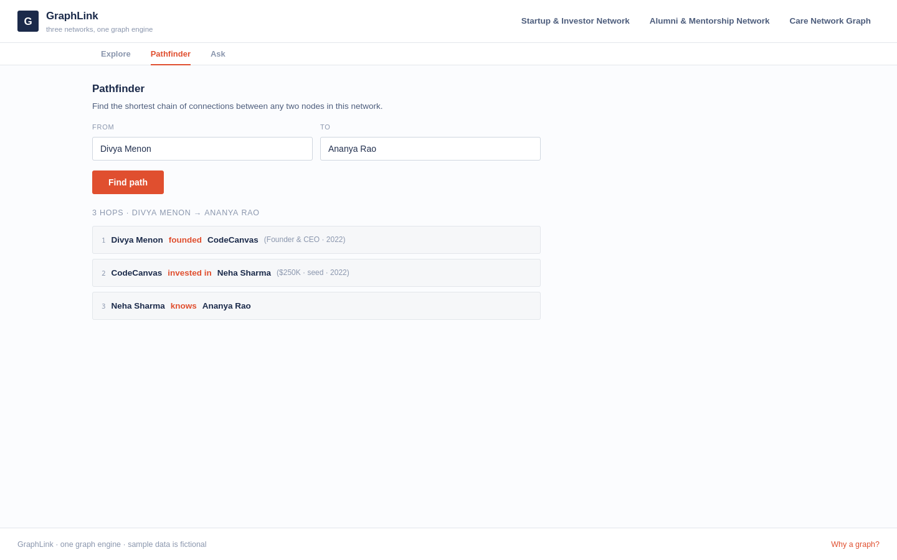
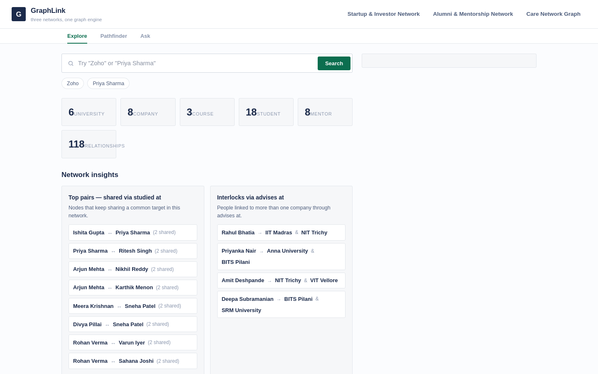
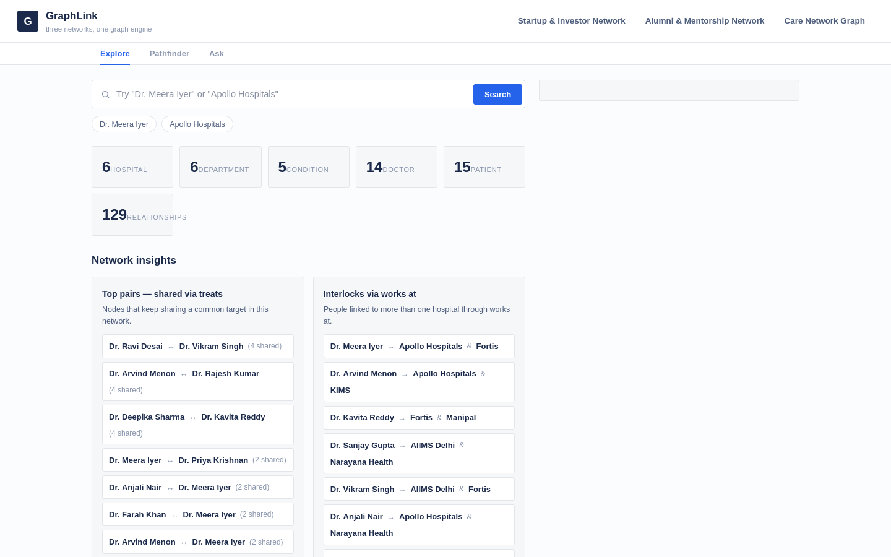
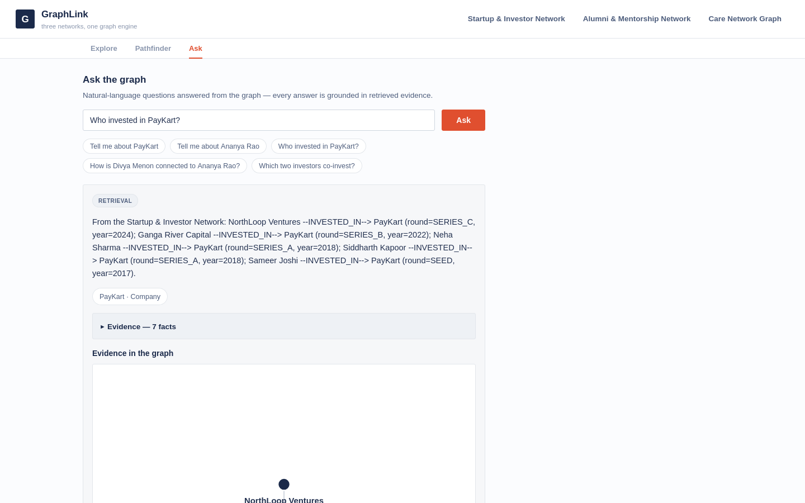
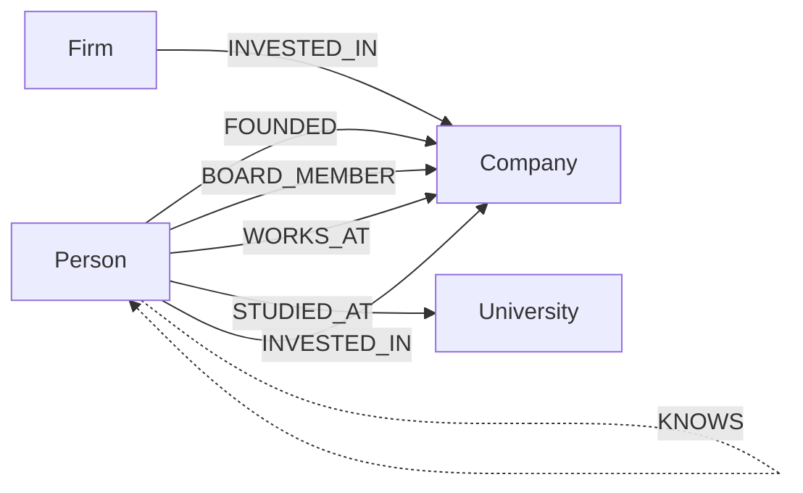
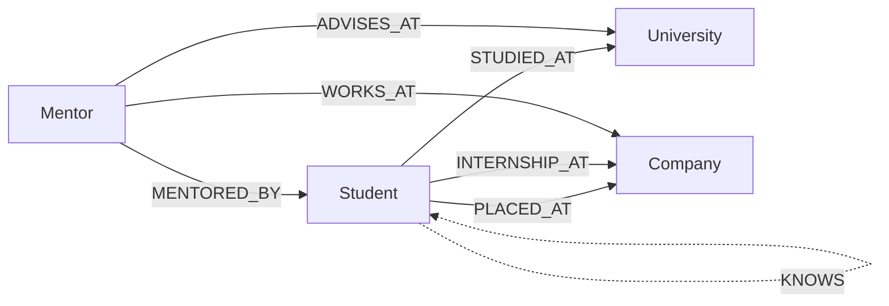
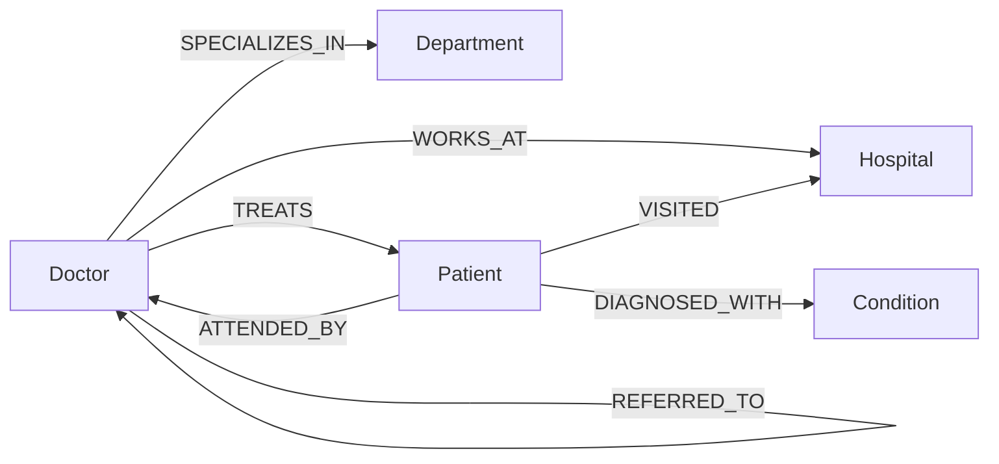

# GraphLink — three networks on one graph engine

One FastAPI app, one Neo4j-compatible graph database (CognoDB), three real-world
networks: who invests in whom, who went to school with whom, and who treated whom.
Every question the app answers is a question *about connections* — so the data
lives in a graph.








---

## The three domains

### Startup & Investor Network
The classic deal-flow dataset: founders, investors (people and firms), companies,
universities, and the edges between them — founded, invested in, sits on the
board, works at, studied at. Questions it answers: which investors co-invest in
the same companies? Which people sit on two boards at once (board interlocks)?
How is investor X connected to founder Y, and through whom?

### Alumni & Mentorship
Students, mentors, universities, companies, and courses, connected by
`STUDIED_AT`, `PLACED_AT`, `INTERNSHIP_AT`, `MENTORED_BY`, `ADVISES_AT` and more.
Questions it answers: which alumni of a university end up at which companies?
Which mentors advise multiple colleges? Which pairs of students shared a
university (co-alumni pairs)?

### Care Network
Doctors, patients, hospitals, departments, and conditions, connected by
`TREATS`, `ATTENDED_BY`, `WORKS_AT`, `SPECIALIZES_IN`, `REFERRED_TO`, and
`VISITED`. Questions it answers: which two doctors share the most patients?
Which doctors work at multiple hospitals? How is a patient connected to a
specialist through referrals?

All three domains live in one graph engine behind one API and one UI — the
queries are identical in shape, only the relationship names differ.

---

## Why a graph database?

This app is a graph database demo, but the argument is practical, not
ideological: the domain model *is* a graph. A company doesn't have a column
called "investors" — it has a set of incoming `INVESTED_IN` edges. A mentor
doesn't have a field for "colleges advised" — they have `ADVISES_AT` edges.
Relationships are first-class data, not foreign keys that have to be joined
back.

The questions the app answers get exponentially harder in SQL the deeper they
go:

- **Shared pairs (2 hops).** "Which two investors back the same companies?" In
  relational terms you join an `investments` table to itself, twice, deduplicate
  the `a < b` mirror pairs, and count. In Cypher it is one `MATCH` over a
  diamond pattern.
- **Alumni chains (2–3 hops).** "Alumni of a university now at a company funded
  by a firm" is a three-relationship walk. In SQL the role edges live in
  different tables (`founded`, `board_member`, `works_at`), so you either UNION
  three joins or model polymorphic foreign keys.
- **Board interlocks.** "People on two boards" is a self-join pair-finder with
  pair deduplication — three `MATCH` clauses in Cypher.
- **Shortest path (up to 6 hops).** "How is X connected to Y?" Across *mixed*
  relationship types. In SQL this is a recursive CTE with cycle guards and
  unbounded depth — thousands of lines in the best case, not supported at all
  in many engines. In a graph it is `shortestPath` with a relationship
  whitelist.
- **Reachability (1..2 hops).** "Everyone within two investments of this
  company." Same recursive-CTE problem, one variable-length pattern in Cypher.

None of these need a schema migration when the data changes shape — you add an
edge and the traversal just works. That is the honest core of the "why graph"
argument: **connection-shaped questions stay connection-shaped queries.**

---

## GraphRAG — Ask the graph

The Ask view answers natural-language questions directly from the graph. It is
the GraphRAG pattern applied to this app: **retrieve on structure, answer with
ground truth, show the path.**

```
question ──▶ intent + entities ──▶ fixed query suite ──▶ facts + subgraph ──▶ grounded answer
natural       LLM-assisted,        the SAME parameter-  evidence for the      LLM from the facts
language      heuristic            ised queries from    answer card +         only (or a retrieval
text          fallback             app/queries.py       auditable fact list   template without a
              without a key        — no new Cypher      + SVG subgraph        key)
```

The pipeline has three stages:

1. **Parse** — the question becomes an intent from a fixed whitelist
   (`portfolio`, `pairs`, `interlocks`, `alumni`, `reach`, `path`, `hubs`,
   `neighborhood`) plus entity names. Gemini does the routing when
   `GEMINI_API_KEY` is set; without a key, keyword rules and graph-grounded
   name matching take over deterministically.
2. **Retrieve** — the intent `SELECT`s existing functions from
   `app/queries.py` (portfolio, shared pairs, interlocks, alumni chains, hubs,
   shortest path, neighborhood...). The LLM never writes Cypher: no query is
   ever built from the question text, only whitelisted parameterised queries
   run.
3. **Answer** — the facts go to Gemini with instructions to answer *only* from
   them (2–4 sentences, citing entity names, or exactly "The graph doesn't
   contain that information."). Without a key, a retrieval template answers
   from the top facts. Either way the evidence is rendered back to the user —
   a fact list plus the subgraph painted by the same SVG renderer as the
   neighborhood view — so every answer is auditable to concrete nodes and
   edges.

Optional `GEMINI_API_KEY` (and `GEMINI_MODEL`, default `gemini-2.5-flash`)
enable the LLM-assisted steps; without them the Ask view serves deterministic
retrieval-only answers. Nothing else changes — the endpoint, intent whitelist,
and caps (≤ 40 facts, ~60 subgraph nodes) are all part of the contract.

---

## Data model

Three subgraphs, one database. Relationship labels are defined in each
domain's `META` config and are never taken from user input — the UI and the
query suite only ever use whitelisted relationship names.

### Startup & Investor Network



### Alumni & Mentorship



### Care Network



---

## Repository layout

```
.
├── main.py                 # FastAPI entrypoint: serves the UI + /api/* routes
├── app/
│   ├── __init__.py
│   ├── db.py               # Neo4j driver + MockDriver (live/mock modes), 503 handling
│   ├── queries.py          # parameterised Cypher suite + ABOUT_QUERIES reference
│   ├── graphrag.py         # GraphRAG "Ask" layer: parse -> retrieve -> grounded answer
│   ├── seed.py             # idempotent seeder: constraints, then nodes, then edges
│   └── domains/
│       ├── __init__.py     # domain registry: investors, education, healthcare
│       ├── investors.py    # Startup & Investor Network dataset + META
│       ├── education.py    # Alumni & Mentorship dataset + META
│       └── healthcare.py   # Care Network dataset + META
├── static/                 # single-page UI, no build step
│   ├── index.html
│   ├── app.js
│   └── style.css
├── scripts/
│   └── screenshots.sh      # headless-Firefox screenshots, --video pipeline
├── images/                 # UI screenshots referenced by this README
├── Dockerfile              # container image for the app
├── render.yaml             # Render free-tier deployment blueprint
├── requirements.txt
├── .env.example            # environment template (no secrets)
└── README.md
```

---

## Setup

### 1. Create a CognoDB instance

1. Go to <https://console.cognodb.com> and sign up.
2. Create a free `c0` instance.
3. Copy the `bolt+s://` connection URI and the database password — the
   password is shown **exactly once**, so save it somewhere safe (for example
   in a password manager).

### 2. Configure the environment

```bash
cp .env.example .env
```

Fill in `COGNODB_URI` and `COGNODB_PASSWORD`. Defaults work for `COGNODB_USERNAME`
(`cognodb`). Never commit `.env` — it is already gitignored.

Optional: `GEMINI_API_KEY` (and `GEMINI_MODEL`, default `gemini-2.5-flash`)
enable LLM-assisted intent/entity routing and grounded answers in the Ask
(GraphRAG) view. Without them the view serves deterministic retrieval-only
answers — every other feature is unaffected.

### 3. Seed the database

```bash
python -m app.seed
```

Loads all three domains (constraints first, then nodes, then relationships).
Idempotent: safe to re-run any number of times.

### 4. Run the app

```bash
uvicorn main:app --port 8000
```

Open <http://127.0.0.1:8000>.

**No database? Explore in mock mode** — the app serves the same datasets from
an in-memory `MockDriver`, so the UI, the queries, and the screenshots workflow
all work before you even create a CognoDB instance:

```bash
MOCK_DB=1 uvicorn main:app --port 8000
```

If the database is unreachable at runtime, the API returns `503` JSON and the
UI shows a friendly "Database unreachable" banner instead of crashing.

---

## The queries

Every query in the app is parameterised: user input only ever appears as
`$parameters`, never inside the query string. Relationship names come from a
hard-coded whitelist in each domain's `META`, and the full query list is
exposed by the backend (`ABOUT_QUERIES`) so a reviewer can verify the
parameterisation guarantee in one click.

Examples below use the investors domain; the same shapes run against the other
domains with different relationship names (e.g. `ATTENDED_BY` for shared
doctor pairs, `STUDIED_AT` for co-alumni pairs).

### Shared pairs — "which two investors co-invest?" *(multi-hop: 2)*

```cypher
MATCH (a)-[:INVESTED_IN]->(c)<-[:INVESTED_IN]-(b)
WHERE a <> b AND a.name < b.name
RETURN a.name AS left, a.type AS left_kind,
       b.name AS right, b.type AS right_kind,
       count(DISTINCT c) AS shared
ORDER BY shared DESC
LIMIT $limit
```

Finds pairs of nodes that share a target, ranked by how many targets they
share. In relational SQL this is a self-join on the investments table (twice)
with `a < b` mirror-pair deduplication and a `COUNT(DISTINCT company)` — and it
needs an index tuned for it.

### Alumni chain — "university → person → company" *(multi-hop: 2–3)*

```cypher
MATCH (u:University {name: $university})<-[:STUDIED_AT]-(p)
MATCH (p)-[r:FOUNDED|BOARD_MEMBER|WORKS_AT]->(c:Company)
RETURN p.name AS person, type(r) AS role, c.name AS company
ORDER BY p.name
LIMIT $limit
```

Every alumni-of-X now at some company, with their role. The 3-hop variant adds
a firm: `(f:Firm)-[:INVESTED_IN]->(c)<-[r]-(p)-[:STUDIED_AT]->(u)` — "alumni of
a university at companies a firm has funded". In SQL the three role edges live
in three different tables, so you need `UNION`s of joins or polymorphic FKs.

### Interlocks — "who sits on two boards?" 

```cypher
MATCH (p)-[:BOARD_MEMBER]->(o1)
MATCH (p)-[:BOARD_MEMBER]->(o2)
WHERE o1 <> o2
RETURN DISTINCT p.name AS person,
       o1.name AS org_a, o2.name AS org_b
LIMIT $limit
```

Same shape detects doctors working at two hospitals (`WORKS_AT`) and mentors
advising multiple colleges (`ADVISES_AT`). In SQL: self-join, pair
generation, deduplication.

### Shortest path — "how are X and Y connected?" *(multi-hop: up to 6)*

```cypher
MATCH (a {name: $frm}), (b {name: $to})
MATCH p = shortestPath((a)-[:FOUNDED|INVESTED_IN|BOARD_MEMBER|WORKS_AT|STUDIED_AT|KNOWS*1..6]-(b))
RETURN p, length(p) AS hops
```

The flagship query. Bounded-depth traversal over mixed relationship types.
Relational equivalent: a recursive CTE with cycle guards over heterogeneous
edge tables — or, in most engines, not expressible at all.

### Reachability — "everyone within two investments" *(multi-hop: 1..2)*

```cypher
MATCH (c {name: $name})<-[:INVESTED_IN*1..2]-(i)
RETURN DISTINCT i.name AS investor, i.type AS kind
```

Variable-length pattern = fixed-shape query regardless of depth. SQL needs a
recursive CTE that grows with the depth you want.

### Portfolio — "who backed this company?"

```cypher
MATCH (c {name: $name})<-[r:INVESTED_IN]-(i)
RETURN i.name AS investor, i.type AS kind,
       r.amount_usd AS amount, r.round AS round, r.year AS year
ORDER BY r.year DESC, r.round
```

Honestly: this one is easy in SQL. It is included because investors are
*people or firms* — in a graph both are just "an investor node with an edge",
while SQL forces two tables (`person_investments`, `firm_investments`) and a
`UNION` everywhere that question is asked.

### Supporting queries

- **Neighborhood (1 hop):** `MATCH (n {name: $name})-[r]-(m)` — everything
  attached to a node, incoming and outgoing, rendered as a 2-hop SVG.
- **Hubs:** `MATCH (n)-[r]-() RETURN n.name, n.type, count(r) AS degree
  ORDER BY degree DESC LIMIT $limit` — most-connected nodes.
- **Search:** `MATCH (n) WHERE n.name CONTAINS $q RETURN n.name, n.type
  LIMIT 25` — typeahead over all node types.
- **Stats:** counts of nodes per type and total edge count.

---

## API

All data endpoints take an optional `?domain=` (default `investors`; one of
`investors`, `education`, `healthcare`) and return `400` for an unknown domain,
`404` with `{"detail": "node not found"}` for missing nodes, and `503` with a
JSON detail when the database is unreachable.

| Endpoint | Description |
| --- | --- |
| `GET /health` | Liveness: `{"status", "db", "mode"}` — mode is `live` or `mock`. |
| `GET /api/domains` | `{"domains": [META...]}` — the three domains with labels, accent colors, sample searches. |
| `GET /api/stats?domain=` | Node counts by type + total edges. |
| `GET /api/node?name=&domain=` | Node properties + 1-hop links. |
| `GET /api/neighborhood?name=&hops=&domain=` | Node + edges for the 2-hop SVG (up to 4 hops). |
| `GET /api/path?from=&to=&domain=` | Shortest path (≤ 6 hops) with step captions. |
| `GET /api/search?q=&domain=` | Name substring search across node types. |
| `GET /api/ask?q=&domain=` | GraphRAG: intent+entity routing, facts, subgraph evidence, grounded answer (source: llm\|retrieval). |
| `GET /api/insights?domain=` | `{"pairs", "interlocks", "alumni", "hubs"}` — the dashboard blocks. |
| `GET /api/portfolio?name=&domain=` | Backers of a company (investors only; `{"supported": false}` elsewhere). |
| `GET /api/reach?name=&domain=` | Nodes within 2 hops (investors only; `{"supported": false}` elsewhere). |

---

## Deployment

The app is a single stateless process; the only state is the CognoDB instance.
It degrades gracefully: if the database credentials are absent, it runs in
mock mode — so a fresh demo deployment works immediately, and switching on the
real database is a matter of setting three environment variables.

### Docker

```bash
docker build -t graphlink .
docker run -p 8000:8000 --env-file .env graphlink
```

The image runs `uvicorn main:app --host 0.0.0.0 --port 8000` and health-checks
`/health` via Python's standard library.

### Render (free tier)

[`render.yaml`](render.yaml) is included in the repo, so you can use "New +
Blueprint" to deploy, or create a Web Service manually:

1. Runtime **Python**, build command `pip install -r requirements.txt`.
2. Start command `uvicorn main:app --host 0.0.0.0 --port 8000`.
3. Health check path `/health`.
4. Add secret environment variables `COGNODB_URI`, `COGNODB_USERNAME`,
   `COGNODB_PASSWORD` in the Render dashboard (the values are never stored in
   the repo or the blueprint).

The service starts instantly in mock mode even before the secrets are added or
the database is seeded, so the demo link is live from the first deploy.

---

## Screenshots

 — the investors tab:
domain tab bar, search, stats, and insights.

 — a node card with its 1-hop links and
the 2-hop neighborhood SVG.

 — a shortest path between two nodes,
rendered step by step.

 — the education domain:
co-alumni pairs, mentor interlocks, alumni pipelines.

 — the healthcare domain:
shared-patient doctor pairs and hospital interlocks.

 — the GraphRAG question-answering
view: a natural-language question, its grounded answer with a source badge, and
the auditable evidence (fact list + subgraph SVG) beneath it.

All screenshots are produced by [`scripts/screenshots.sh`](scripts/screenshots.sh):

```bash
MOCK_DB=1 uvicorn main:app --port 8091 &   # terminal 1: run the app
./scripts/screenshots.sh                    # terminal 2: capture the PNGs
```

---

## Screen recording

The demo video was built from the same screenshots, so the recording and the
README never drift apart. Run the script with `--video`:

```bash
./scripts/screenshots.sh --video
```

This captures the PNGs as above and then feeds them in order to ffmpeg
(`/usr/bin/ffmpeg`) at 1 fps, producing `out.mp4` — a narrated-style walkthrough
you can upload to YouTube (unlisted) or Loom and drop into the submission
email.

---

## License

MIT — see the repository for details.
